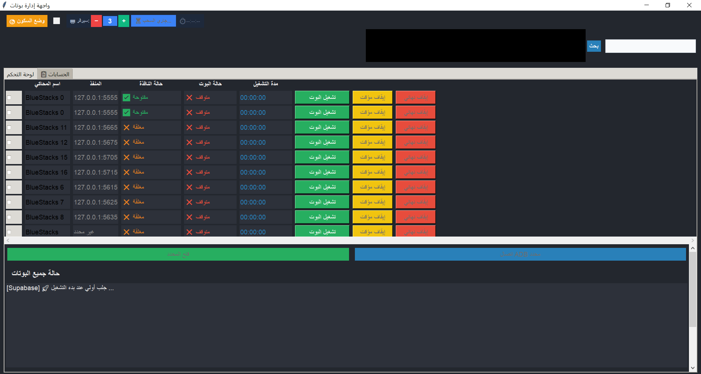

# ibraaBot

### نظام أتمتة متقدم لإدارة وتشغيل عدة حسابات في لعبة العثمانية عبر محاكيات Android متعددة

<p align="center">
  
</p>

---

## نبذة عن المشروع

**ibraaBot** هو نظام Automation متكامل تم تطويره لإدارة وتشغيل عدة حسابات في لعبة **العثمانية (Days of Empire)** بشكل آلي، من خلال تشغيل عدة محاكيات Android في نفس جهاز الكمبيوتر والتحكم بها بشكل مستقل ومتزامن.

المشروع ليس مجرد Script يقوم بتنفيذ نقرات متكررة، بل تم تطويره كنظام متكامل يحتوي على طبقات لإدارة المحاكيات، التواصل مع Android، تحليل الشاشة باستخدام Computer Vision، تنفيذ المهام، إدارة حالة كل حساب، التعامل مع الأخطاء، وحفظ البيانات واستعادتها.

الفكرة الأساسية هي تحويل مجموعة كبيرة من المهام اليدوية والمتكررة داخل اللعبة إلى **Workflows آلية قابلة للتنفيذ والمراقبة والاستعادة**.

---

# 🎬 تجربة النظام

وضعت فيديو توضيحيًا للنظام داخل المشروع:

**[▶️ مشاهدة فيديو ibraaBot](assets/t1.mp4)**

الفيديو يوضح واجهة النظام وطريقة عمل الـAutomation مع المحاكيات.

---

# ماذا يفعل ibraaBot؟

يتيح النظام تشغيل وإدارة عدة محاكيات Android من خلال واجهة تحكم واحدة.

يمكن أن يمثل كل Emulator حسابًا مستقلًا، ثم يقوم النظام بإدارة المهام الخاصة بهذا الحساب بشكل منفصل.

بشكل مبسط:

```text
                         جهاز الكمبيوتر
                               │
                               ▼
                       ┌──────────────┐
                       │   ibraaBot   │
                       │     GUI      │
                       └───────┬──────┘
                               │
             ┌─────────────────┼─────────────────┐
             │                 │                 │
             ▼                 ▼                 ▼
       BlueStacks #1     BlueStacks #2     BlueStacks #3
             │                 │                 │
             ▼                 ▼                 ▼
          حساب 1             حساب 2             حساب 3
             │                 │                 │
             └─────────────────┼─────────────────┘
                               ▼
                       Automation Engine
                               │
                ┌──────────────┼──────────────┐
                ▼              ▼              ▼
           Computer Vision   Workflows     State Manager
```

---

# كيف يعمل النظام؟

يمر تنفيذ المهمة بعدة مراحل مترابطة.

## 1. اكتشاف المحاكيات

يقوم النظام بالتعرف على محاكيات **BlueStacks** واتصالات **ADB** الخاصة بها.

وبذلك يستطيع معرفة البيئة التي سيتم التحكم بها وربطها بالحساب والحالة المناسبة.

```text
BlueStacks
     │
     ▼
ADB Endpoint Discovery
     │
     ▼
Emulator Mapping
     │
     ▼
Automation Instance
```

---

## 2. الاتصال ببيئة Android

بعد تحديد المحاكي، يتواصل النظام معه من خلال طبقة Android Automation.

التقنيات المستخدمة تشمل:

- ADB
- uiautomator2
- BlueStacks
- Screenshot Capture
- Touch Interaction
- Text Input
- Application Control

وبذلك يستطيع محرك Python تنفيذ الإجراءات داخل بيئة Android.

---

# 3. فهم حالة الشاشة

هذه من أهم أجزاء المشروع.

بدل الاعتماد على إحداثيات ثابتة فقط، يستطيع النظام التقاط Screenshot وتحليل الشاشة للبحث عن عناصر محددة.

يستخدم المشروع **OpenCV** وعمليات **Template Matching** للتعرف على عناصر الواجهة.

```text
Screenshot
     │
     ▼
Image Processing
     │
     ▼
Template Matching
     │
     ▼
Confidence Check
     │
     ▼
Element Detected
     │
     ▼
Execute Action
```

وهذا يجعل الـAutomation قادرًا على الاستجابة للحالة الحالية للشاشة بدل تنفيذ سلسلة ثابتة من النقرات.

---

# 4. تنفيذ المهام

تم تقسيم وظائف النظام إلى Modules مستقلة.

من أمثلة الوظائف الموجودة في المشروع:

- الهجوم
- التحالف
- جمع الموارد
- Loot
- إدارة القوات
- الكنوز
- المسارات والتنقل
- الحماية
- الحيوانات
- Power
- وغيرها من المهام الخاصة باللعبة

هذا التنظيم يسمح بتطوير كل جزء بشكل مستقل وتقليل الترابط بين المهام المختلفة.

---

# 5. نظام Workflow

المهام داخل النظام ليست مجرد سلسلة أوامر طويلة.

يتم تقسيم الـWorkflow إلى مراحل وخطوات يمكن تتبعها.

مثال:

```text
فتح اللعبة
    │
    ▼
الدخول إلى الحساب
    │
    ▼
فتح القسم المطلوب
    │
    ▼
البحث عن العنصر
    │
    ▼
تنفيذ المهمة
    │
    ▼
التحقق من النتيجة
    │
    ▼
الانتقال للخطوة التالية
```

ويستطيع النظام تتبع المرحلة الحالية وإعادة تشغيل الـWorkflow عند الحاجة.

---

# 6. التعامل مع الأخطاء

أحد أكبر تحديات Automation هو أن البيئة ليست ثابتة.

قد تتأخر اللعبة، أو لا يظهر عنصر معين، أو يحدث فشل أثناء تنفيذ خطوة.

لذلك يحتوي النظام على آليات مثل:

- Timeout Handling
- Retry Logic
- Step Tracking
- Runtime Status
- Workflow Restart
- State Recovery
- Data Validation

الهدف هو تقليل الحاجة إلى إعادة تشغيل النظام بالكامل عند حدوث مشكلة في خطوة واحدة.

---

# إدارة عدة حسابات

الميزة الأساسية في المشروع هي القدرة على إدارة عدة بيئات Android من جهاز واحد.

كل Emulator يمكن أن يمتلك:

- اتصال ADB مستقل
- حساب مستقل
- حالة مستقلة
- Workflow مستقل
- بيانات مستقلة

```text
Computer
│
├── Emulator 1
│   └── Account A
│       ├── Workflow
│       └── State
│
├── Emulator 2
│   └── Account B
│       ├── Workflow
│       └── State
│
├── Emulator 3
│   └── Account C
│       ├── Workflow
│       └── State
│
└── Emulator N
    └── Account N
        ├── Workflow
        └── State
```

وهذا يجعل النظام مناسبًا لتشغيل عمليات Automation متعددة في وقت واحد.

---

# إدارة البيانات والحالة

يحتوي المشروع على طبقة مخصصة لإدارة بيانات الحسابات وحالة التشغيل.

يتم استخدام JSON في أجزاء من النظام، مع وجود آليات لحماية البيانات.

## File Locking

يتم استخدام File Lock لمنع عمليات متعددة من الكتابة على نفس البيانات في الوقت نفسه.

## Data Validation

يتم التحقق من صحة البيانات قبل استخدامها.

## Automatic Backups

يستطيع النظام إنشاء نسخ احتياطية من البيانات.

## Backup Rotation

يتم الاحتفاظ بعدد محدد من النسخ وتنظيف النسخ القديمة.

## Recovery

عند حدوث مشكلة في بيانات التشغيل، يمكن استخدام النسخ الاحتياطية لاستعادة الحالة السابقة.

---

# Supabase Integration

يدعم النظام المزامنة مع **Supabase** لبعض بيانات الحسابات وحالة التشغيل.

```text
                 ibraaBot
                    │
          ┌─────────┴─────────┐
          │                   │
          ▼                   ▼
    Local State          Supabase
       JSON              Remote State
          │                   │
          └─────────┬─────────┘
                    ▼
               Account State
```

وتتم بعض عمليات المزامنة في الخلفية حتى لا تؤثر على تنفيذ الـAutomation.

---

# واجهة التحكم

تم تطوير واجهة Desktop للتحكم في النظام ومتابعة عمليات الـAutomation.

بدل تشغيل كل Script بشكل منفصل، توفر الواجهة طبقة تحكم مركزية بالنظام والمحاكيات.

```text
                    GUI
                     │
       ┌─────────────┼─────────────┐
       ▼             ▼             ▼
   Emulator 1    Emulator 2    Emulator 3
       │             │             │
       ▼             ▼             ▼
   Workflow      Workflow      Workflow
       │             │             │
       ▼             ▼             ▼
     State         State         State
```

لقطة من الواجهة:

<p align="center">
  
</p>

---

# البنية البرمجية

تم تقسيم المشروع إلى عدة Modules بدل وضع جميع الوظائف في ملف واحد.

```text
ibraaBot/
│
├── main_gui_222.py
│   └── الواجهة الرئيسية والتحكم بالنظام
│
├── Manager_Json.py
│   └── إدارة البيانات والحالة والنسخ الاحتياطية
│
├── bot_stage_email1.py
│   └── إدارة مراحل وتنفيذ بعض Workflows
│
├── Dream.py
├── Attauck1.py
├── Alliance1.py
├── Treasure.py
├── Loot1.py
├── Troops1.py
├── Power_1.py
├── Path.py
├── animal.py
├── protection1.py
│   └── وحدات Automation متخصصة
│
├── Resources_Reader.py
│   └── قراءة ومعالجة بيانات الشاشة
│
├── image/
│   └── قوالب الصور المستخدمة في Computer Vision
│
├── debug_resources/
│   └── موارد الاختبار والتصحيح
│
├── assets/
│   ├── main-interface.png
│   └── t1.mp4
│
├── requirements.txt
├── RUN.bat
└── .gitignore
```

---

# Computer Vision Pipeline

يعتمد النظام على الصور المرجعية الموجودة داخل مجلد `image/`.

ويتم استخدامها للتعرف على عناصر مختلفة من واجهة اللعبة.

```text
                Emulator Screenshot
                        │
                        ▼
                Image Processing
                        │
                        ▼
                 Template Search
                        │
                        ▼
                Match Confidence
                        │
                  ┌─────┴─────┐
                  │           │
               Found       Not Found
                  │           │
                  ▼           ▼
               Action     Wait / Retry
```

---

# Reliability & Fault Tolerance

تم تطوير عدة آليات لتحسين استقرار النظام أثناء التشغيل لفترات طويلة:

- حفظ الحالة
- File Locking
- Data Validation
- Automatic Backups
- Backup Rotation
- Recovery
- Timeout Handling
- Workflow Tracking
- Runtime Monitoring
- Independent Instance State

هذه الآليات مهمة خصوصًا عند تشغيل عدة محاكيات وحسابات في الوقت نفسه.

---

# التحديات الهندسية

## التعامل مع واجهة ديناميكية

اللعبة لا توفر API مخصصة لتنفيذ هذه المهام، لذلك يعتمد النظام على تحليل الشاشة والتفاعل مع Android.

## إدارة عدة محاكيات

كل Emulator يمثل بيئة مستقلة تحتاج إلى إدارة اتصال وحالة وWorkflow خاص بها.

## التشغيل لفترات طويلة

Automation طويل المدى يحتاج إلى التعامل مع:

- التأخير
- فشل الخطوات
- تغير حالة الشاشة
- إعادة المحاولة
- استعادة الحالة

## حماية البيانات

عند وجود عمليات متعددة تعمل في الوقت نفسه، تصبح حماية ملفات الحالة من الكتابة المتزامنة أمرًا مهمًا.

---

# التقنيات المستخدمة

| التقنية          | الاستخدام                          |
| ---------------- | ---------------------------------- |
| **Python**       | المحرك الرئيسي للنظام              |
| **OpenCV**       | Computer Vision وTemplate Matching |
| **NumPy**        | معالجة الصور والبيانات             |
| **ADB**          | الاتصال بمحاكيات Android           |
| **uiautomator2** | Android UI Automation              |
| **BlueStacks**   | تشغيل بيئات Android المتعددة       |
| **Supabase**     | المزامنة والتخزين عن بعد           |
| **JSON**         | تخزين الحالة والبيانات             |
| **Threading**    | العمليات الخلفية والتزامن          |
| **Windows**      | بيئة التشغيل الأساسية              |

---

# التشغيل

## المتطلبات

- Windows
- Python 3.x
- BlueStacks
- ADB
- Android Emulator Instances
- المكتبات الموجودة في `requirements.txt`

## تثبيت المكتبات

```bash
pip install -r requirements.txt
```

## تشغيل النظام

```bash
python main_gui_222.py
```

أو باستخدام:

```text
RUN.bat
```

> قد تحتاج ملفات التشغيل إلى تعديل المسارات لتناسب بيئة التشغيل المحلية.

---

# الأمان

لا يجب وضع أي بيانات سرية داخل Source Code.

مثل:

- API Keys
- Supabase Keys
- Passwords
- Session Tokens
- Access Tokens

يفضل استخدام Environment Variables:

```env
SUPABASE_URL=your_supabase_url
SUPABASE_KEY=your_supabase_key
```

ويجب التأكد من عدم رفع ملفات الأسرار إلى GitHub.

---

# ما الذي يمثله هذا المشروع تقنيًا؟

رغم أن المشروع تم تطويره لأتمتة لعبة، إلا أن الجانب الهندسي فيه يتجاوز فكرة **Game Bot** التقليدية.

يمثل المشروع تجربة عملية في:

- Automation Engineering
- Computer Vision
- Android Automation
- Multi-Instance Orchestration
- Workflow Management
- Concurrent Execution
- State Management
- Data Integrity
- Failure Recovery
- Remote Synchronization
- Desktop Automation

---

# حالة المشروع

**Active Development**

المشروع قابل للتطوير وإضافة Workflows جديدة وتحسين إدارة المحاكيات والاعتمادية والأداء.

---

# المطور

## مخلدون

**Frontend JavaScript Developer · AI Automation Engineer**

أعمل على بناء تطبيقات الويب وأنظمة Automation التي تجمع بين:

- JavaScript / Frontend Development
- AI Automation
- Workflow Automation
- Computer Vision
- API Integration
- Backend Services

---

## Disclaimer

تم تطوير المشروع لأغراض تعليمية وتجريبية في مجال Automation.

يجب استخدام أدوات الأتمتة بما يتوافق مع شروط وسياسات البرامج والخدمات التي يتم التعامل معها.
