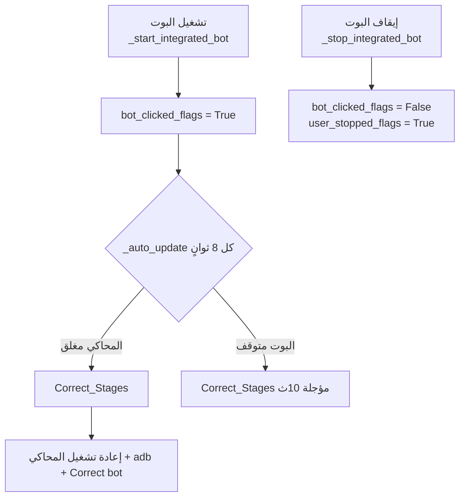

# 📋 فهرس ملف `main_gui_222.py`

> **الملف:** `d:\server_3\interface\main_gui_222.py`  
> **الحجم:** ~1996 سطر | ~98 KB  
> **آخر تحديث للفهرس:** 2026-04-04 (v2)

---

## 🗂️ الهيكل العام

```
1 – 17      → الاستيرادات (imports)
19 – 196    → دوال Supabase المستقلة (خارج الكلاس)
200 – 219   → إعداد DPI على Windows
220 – 285   → الثوابت والمتغيرات العامة (NUM_EMULATORS, THEMES, COLUMNS…)
287 – 367   → الكلاسات المساعدة: Toast, EmulatorRow, UpdateIndicator
369 – 461   → الكلاس: BotVillageComponent
463 – ~1996 → الكلاس الرئيسي: MainApp (tk.Tk)
~1980–1996  → نقطة التشغيل if __name__ == "__main__"
```

---

## 1. الاستيرادات والإعداد الأولي (السطور 1 – 219)

| السطور | المحتوى |
|--------|---------|
| 1–14 | مكتبات Python القياسية: `psutil`, `tkinter`, `json`, `threading`, `time`, `subprocess`, `os`, `re`, `unicodedata`, `traceback`, `sys`, `multiprocessing`, `typing` |
| 15 | استيراد من `Manager_Json`: `BotDataManager`, `extract_device_mapping`, `extract_instance_numbers`, `extract_instance_names` |
| 16 | استيراد `run_Power_manager1` من `Power_1` |
| 17 | استيراد `run_Correct_manager1` من `Correct` |
| 22–29 | ثوابت Supabase: `SUPABASE_URL`, `SUPABASE_KEY`, `ACCOUNTS_PER_EMULATOR=12`, `AUTO_FETCH_INTERVAL=3600` |
| 201–214 | ضبط DPI Awareness لـ Windows (SetProcessDpiAwareness) |
| 216–218 | إضافة مسار الملف الحالي لـ `sys.path` |

---

## 2. دوال Supabase المستقلة (السطور 32 – 196)

| السطور | الدالة | الوصف |
|--------|--------|-------|
| 32–39 | `_sb_load_config()` | تحميل إعدادات server_index من `supabase_gui_config.json` |
| 42–47 | `_sb_save_config(data)` | حفظ الإعدادات في JSON |
| 50–52 | `_sb_client()` | إنشاء عميل Supabase |
| 55–73 | `_sb_check_and_reset_is_change(server_index)` | فحص جدول `Changes` → يُرجع True إذا `Is_Change=True` ويعيد تعيينها |
| 76–90 | `_sb_fetch_accounts(server_index)` | جلب الحسابات من جدول `Accounts` حيث `index_server=N AND Is_OK=True` |
| 93–130 | `_sb_to_village(account)` | تحويل صف Supabase إلى بنية القرية (JSON) مع معالجة `Collect_resources` و `Attack resources` |
| 133–134 | `_sb_get_json_path(bot_index)` | يُرجع مسار ملف JSON للبوت |
| 137–148 | `_sb_load_json(path)` | تحميل ملف JSON مع قيم افتراضية |
| 151–154 | `_sb_save_json(path, data)` | حفظ ملف JSON |
| 157–167 | `_sb_existing_bot_files()` | قائمة بأرقام ملفات JSON الموجودة على القرص |
| 170–196 | `_sb_apply_accounts(accounts)` | توزيع الحسابات (12 لكل بوت) على ملفات JSON، وتفريغ الملفات الزائدة |

---

## 3. الثوابت والمتغيرات العامة (السطور 220 – 285)

| السطور | المتغير | القيمة / الوصف |
|--------|---------|----------------|
| 227 | `NUM_EMULATORS` | عدد المحاكيات = **15** |
| 230–244 | `LIGHT_THEME` | ألوان وخطوط الوضع النهاري |
| 245–259 | `DARK_THEME` | ألوان وخطوط الوضع الليلي (الافتراضي) |
| 262–266 | `DEFAULT_*` | قيم افتراضية للعرض (PORT, WINDOW, BOT, ERROR, UPTIME) |
| 268–275 | `COLUMNS` | أعمدة جدول المحاكيات: checkbox, اسم, منفذ, حالة النافذة, حالة البوت, مدة التشغيل |
| 277 | `Contact_PORT` | أسماء instances من `extract_instance_names()` |
| 279 | `number_instance` | أرقام instances |
| 281–283 | `MAIN_PORTS`, `EMULATOR_PORTS` | خريطة المنافذ لكل محاكي |
| 285 | `LDCONSOLE_PATH` | مسار `HD-Player.exe` لـ BlueStacks |

---

## 4. الكلاسات المساعدة

### 4.1 `Toast` (السطر 287–298)
نافذة إشعار مؤقتة تظهر في الزاوية السفلية اليمنى وتختفي بعد مدة.

### 4.2 `EmulatorRow` (السطر 300–356)
يمثل صفاً واحداً في جدول المحاكيات.

| العنصر | الوصف |
|--------|-------|
| `checkbox` | تحديد المحاكي |
| `name_label` | `BlueStacks {N}` |
| `port_label` | رقم المنفذ |
| `window_status` | مفتوحة / مغلقة |
| `bot_status` | يعمل / متوقف / متوقف مؤقتاً |
| `uptime_label` | مدة التشغيل بالأيام |
| `start_bot_btn` | زر تشغيل البوت |
| `pause_resume_btn` | زر إيقاف/استئناف مؤقت |
| `stop_bot_btn` | زر إيقاف نهائي |

**الدوال الرئيسية:**
- `set_open(is_open)` → تحديث حالة النافذة
- `update_bot_status(status)` → تحديث حالة البوت وأزراره
- `update_theme(theme)` → تغيير الثيم

### 4.3 `UpdateIndicator` (السطر 358–367)
دائرة صغيرة خضراء تومض عند حدوث تحديث تلقائي.

### 4.4 `BotVillageComponent` (السطر 369–461)
مكوّن واجهة لكل حساب (قرية) داخل تبويب البوت.

| السطور | الدالة | الوصف |
|--------|--------|-------|
| 420–424 | `toggle_password_visibility()` | إظهار/إخفاء كلمة السر |
| 425–430 | `_limit_attack_selection()` | يمنع اختيار أكثر من نوعين للهجوم |
| 431–440 | `get_data()` | يُرجع dict يحتوي: email, password, options[4], Attauck[], custom_flag, Troops, Not_Store |
| 441–454 | `set_data(data)` | تحميل البيانات في حقول الواجهة |
| 456–461 | `update_edit_state()` | تعطيل زر التعديل إذا كان المحاكي مفتوحاً |

---

## 5. الكلاس الرئيسي `MainApp` (السطر 463 – ~1996)

### 5.1 `__init__` (السطر 464–523)
تهيئة التطبيق: الإعدادات الأساسية، قوائم الحالة، بناء الواجهة، بدء الخيوط.

**المتغيرات المهمة:**
| المتغير | الوصف |
|---------|-------|
| `self.theme` | الثيم الحالي (DARK_THEME افتراضياً) |
| `self.emulator_rows[]` | قائمة بـ 15 EmulatorRow |
| `self.bot_villages[]` | قائمة بـ 15 قاموس {frame, components[]} |
| `self.bot_processes[]` | 15 Process (multiprocessing) |
| `self.bot_clicked_flags[]` | True إذا تم النقر على زر تشغيل البوت |
| `self.user_stopped_flags[]` | True إذا أوقف المستخدم البوت يدوياً |
| `self.bot_start_times[]` | وقت بدء كل بوت |
| `self.bot_elapsed_times[]` | مجموع ثواني تشغيل كل بوت |
| `self.last_correct_stages_check[]` | طابع زمني آخر فحص Correct_Stages |
| `self.pending_correct_checks[]` | منع تكرار الفحوصات المؤجلة |
| `self._status_cache[]` | cache لحالة البوت (TTL=2 ثانية) |
| `self._sb_cfg` | إعدادات Supabase (server_index) |
| `self._accounts_canvas` | Canvas الصفحة الموحدة للحسابات |
| `self._accounts_inner` | Frame داخل الـ Canvas الموحد |
| `self._bot_section_frames[]` | LabelFrame لكل بوت (15 قسم) |

---

### 5.2 بناء الواجهة `_build_ui` (السطر 626–~870)

**هيكل التبويبات (Notebook):**
- **تبويب 0**: لوحة التحكم (main_tab)
- **تبويب 1**: 📋 الحسابات (accounts_tab) — صفحة موحدة تعرض 15 قسم

```
626–636   → شريط الإحصائيات العلوي + زر وضع السكون
638–639   → stats_label (إحصائيات مخصصة مستقبلاً)
641–642   → UpdateIndicator (مؤشر التحديث)
643–678   → حقل البحث + قائمة نتائج البحث
681–683   → Notebook (تبويبان فقط)
685–763   → صفحة الحسابات الموحدة:
              - Canvas + Scrollbar رأسي وأفقي
              - 15 LabelFrame (قسم لكل بوت)
              - كل قسم: villages_frame + أزرار (إضافة، حفظ، حفظ بدون تغيير، تحديث، حذف الكل)
764–810   → لوحة التحكم: Canvas+Scroll + جدول المحاكيات (EmulatorRows)
812–826   → أزرار عمليات: فتح المحدد, اتصال ADB محدد
828–835   → منطقة عرض السجل (status_text)
838–841   → زر الإعدادات
844–~870  → قسم Supabase: label سيرفر + زر +/- + زر جلب + عداد تنازلي
```

---

### 5.3 دوال التحكم بالسكون

| السطور | الدالة | الوصف |
|--------|--------|-------|
| 532–564 | `toggle_sleep_mode()` | تفعيل/إلغاء وضع السكون (overlay شاشة كاملة) |
| 615–625 | `_customize_style()` | تخصيص ألوان ttk.Style |
| ~872 | `_update_buttons()` | تفعيل/تعطيل أزرار العمليات بناءً على التحديد |

> ⚠️ تم حذف `toggle_theme()` وزر الوضع الليلي بالكامل

---

### 5.4 دوال Supabase في الكلاس

| السطور | الدالة | الوصف |
|--------|--------|-------|
| ~877 | `show_toast(msg, duration)` | عرض إشعار Toast |
| ~879–883 | `_on_app_close()` | حفظ server_index عند الإغلاق |
| ~889–894 | `_sb_increment_server()` | زيادة رقم السيرفر (+1) |
| ~896–902 | `_sb_decrement_server()` | إنقاص رقم السيرفر (-1) |
| ~904–908 | `_sb_on_fetch_click()` | جلب يدوي (يشغّل thread) |
| ~910–947 | `_sb_fetch_worker(auto)` | عامل الجلب الفعلي: يجلب ويُطبّق ويُحدّث الواجهة |
| ~949–988 | `_sb_auto_fetch_loop()` | حلقة تعمل في thread: جلب فوري + عداد ساعة + فحص Is_Change |
| ~991 | `_append_status_threadsafe(msg)` | إضافة رسالة للسجل من thread آخر |

---

### 5.5 دوال التحديث التلقائي

| السطور | الدالة | الوصف |
|--------|--------|-------|
| ~994–1003 | `_start_auto_update()` | يبدأ حلقة تحديث كل 8 ثوانٍ (20 في وضع السكون) |
| ~1005–1069 | `_auto_update()` | التحديث الدوري: فحص ADB + Correct_Stages + تحديث حالة البوتات |
| ~1072–1098 | `_update_emulator_states_from_adb()` | يُشغّل `adb devices` ويُحدّث حالة النوافذ (مفتوحة/مغلقة) |

---

### 5.6 دوال التحكم في البوت

| السطور | الدالة | الوصف |
|--------|--------|-------|
| 567–612 | `Correct_Stages(idx)` | إيقاف البوت → إغلاق المحاكي → إعادة فتحه → ADB → تشغيل `run_Correct_manager1` |
| ~1100 | `MAX_RUNNING_BOTS = 15` | الحد الأقصى للبوتات المتزامنة |
| ~1102–1104 | `_get_running_bots_count()` | عدد البوتات الشغّالة حالياً |
| ~1106–1181 | `_start_integrated_bot(device_id)` | تشغيل بوت جديد عبر `run_Power_manager1` + فحص تأكيد بعد 6 ثوانٍ |
| ~1186–1207 | `_pause_resume_integrated_bot(device_id)` | إيقاف/استئناف مؤقت عبر ملف `pause_{device_id}.flag` |
| ~1209–1251 | `_stop_integrated_bot(device_id)` | إيقاف نهائي (terminate) + تنظيف الحالة |
| ~1254–1307 | `_get_integrated_bot_status(idx)` | يُرجع حالة البوت من: العملية + ملف `status_{port}.json` + heartbeat (30ث) مع cache |
| ~1309–1312 | `_clear_status_cache(idx)` | مسح cache الحالة |
| ~1314–1317 | `_update_emulator_row_status(idx)` | تحديث العرض البصري لصف المحاكي |
| ~1830–1852 | `Fire_Stages(idx)` | تشغيل البوت مباشرة (بدون إعادة تشغيل المحاكي) |

---

### 5.7 دوال إدارة المحاكيات

| السطور | الدالة | الوصف |
|--------|--------|-------|
| ~1318–1324 | `open_selected()` | فتح المحاكيات المحددة |
| ~1326–1331 | `Contact_selected()` | ربط ADB للمحاكيات المحددة |
| ~1333–1341 | `close_selected()` | إغلاق المحاكيات المحددة (مع تأكيد) |
| ~1342–1364 | `_close_emulator_instance(idx)` | إغلاق instance بالاسم عبر `taskkill /F /PID` |
| ~1460–1471 | `_open_emulator_instance(idx)` | تشغيل instance عبر `HD-Player.exe --instance {name}` |
| ~1473–1484 | `_Contact_emulator_instance(idx)` | `adb connect {port}` |

---

### 5.8 دوال إدارة بيانات البوت (القرى/الحسابات)

| السطور | الدالة | الوصف |
|--------|--------|-------|
| ~1369–1375 | `open_settings()` | نافذة الإعدادات المتقدمة (placeholder حالياً) |
| ~1377–1393 | `add_village(bot_idx)` | إضافة حساب جديد (BotVillageComponent) للبوت |
| ~1394–1398 | `delete_village(bot_idx, comp)` | حذف حساب واحد مع تأكيد وحفظ |
| ~1399–1404 | `edit_village(bot_idx, comp)` | تعديل حساب (حفظ مباشر) |
| ~1405–1424 | `save_villages(bot_idx)` | حفظ الحسابات مع زيادة save_counter + تجاهل الفارغة |
| ~1425–1439 | `save_villages_preserve_index(bot_idx)` | حفظ مع الإبقاء على account_index كما هو |
| ~1440–1454 | `load_villages(bot_idx)` | تحميل الحسابات من JSON وعرضها |
| 1519–1788 | `show_whatsapp_parser_window()` | ⚠️ نافذة معالج رسائل الواتساب – **مرشحة للحذف** (الزر تم حذفه من UI) |
| ~1789–1801 | `_update_bot_interface(bot_idx)` | مسح مكونات البوت وإعادة تحميلها + الانتقال لتبويب الحسابات |
| ~1803–1826 | `delete_all_villages(bot_idx)` | حذف جميع الحسابات مع تأكيد |

---

### 5.9 دوال Uptime (مدة التشغيل)

| السطور | الدالة | الوصف |
|--------|--------|-------|
| ~1486–1492 | `_start_uptime_updater()` | يبدأ thread لتحديث العداد كل ثانية |
| ~1495–1516 | `_update_all_uptimes()` | يحسب ويعرض عدد الأيام لكل بوت |

---

### 5.10 دوال البحث والتنقل

| السطور | الدالة | الوصف |
|--------|--------|-------|
| ~1855–1882 | `_search_email_in_jsons()` | البحث عن بريد إلكتروني في ملفات JSON لجميع البوتات |
| ~1884–1914 | `_smooth_scroll_canvas(canvas, orientation, ...)` | تمرير ناعم للـ Canvas |
| ~1916–1951 | `_activate_search_result()` | الانتقال لتبويب الحسابات + التمرير لقسم البوت المعني |

---

### 5.11 دوال المساعدة

| السطور | الدالة | الوصف |
|--------|--------|-------|
| ~1366–1370 | `_append_status(msg)` | إضافة رسالة لمنطقة السجل (status_text) |

---

## 6. نقطة تشغيل التطبيق (السطر ~1980–1996)

```python
if __name__ == "__main__":
    multiprocessing.freeze_support()
    app = MainApp()
    app.mainloop()
```

---

## 7. تدفق الحالة الرئيسي



---

## 8. ملفات خارجية يتعامل معها الكود

| الملف | الموقع | الاستخدام |
|-------|--------|-----------|
| `bot_data/bot_{N}_villages.json` | نفس المجلد | بيانات حسابات كل بوت |
| `status_{port}.json` | مجلد التشغيل | حالة البوت + heartbeat |
| `pause_{port}.flag` | مجلد التشغيل | إيقاف مؤقت |
| `supabase_gui_config.json` | نفس المجلد | حفظ server_index |

---

## 9. ⚠️ ملاحظات مهمة للتعديل

1. **دالة `show_whatsapp_parser_window`** (السطور ~1519–1788): الزر أُزيل من الواجهة، لكن الدالة لا تزال موجودة في الكود — يمكن حذفها مستقبلاً
2. **تبويبات الواجهة:** تبويبان فقط: `لوحة التحكم` (0) و `الحسابات` (1)
3. **`bot_tabs`** لا يُستخدم بعد الآن (كان يحتفظ بإطارات 15 تبويب) — يمكن حذفه
4. **`toggle_theme()`** تم حذفها بالكامل — الثيم ثابت `DARK_THEME`
5. **`close_btn`** لا يزال مُعلّقاً (commented out)
6. **`MAX_RUNNING_BOTS = 15`** موجود لكنه غير فعّال حالياً
7. **عدد المحاكيات ثابت** `NUM_EMULATORS = 15`
8. **صفحة الحسابات الموحدة:** تستخدم Canvas واحد + 15 LabelFrame → أخف بكثير من 15 Canvas
